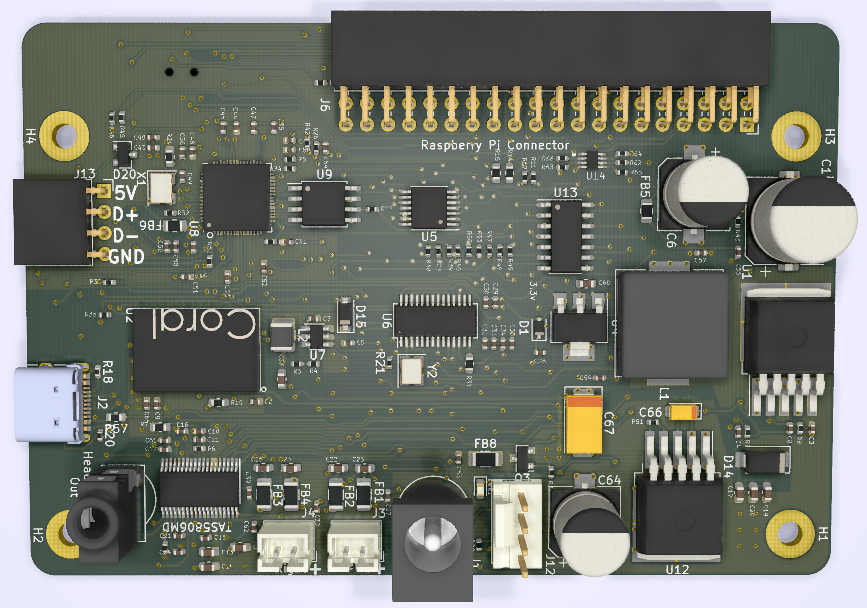

# SJ201 Datasheet

*⛵️ Note that this repository is a work-in-progress. It will be updated and improved on over time.*

This is the first prototype design for the Mark II daughterboard PCB (SJ201).

This board interfaces directly to the Raspberry Pi 4 via the 40-pin GPIO adding a high-quality speaker and microphone array, as well as LEDs and hardware inputs for non-voice interaction and feedback.

The SJ201 can also be used as a USB microphone array with barge-in support. In this configuration the amplifiers do not work as the USB port cannot supply the required power.

The part number SJ201 is derived from Mike’s “Simon Jester” alias in “The Moon is a Harsh Mistress”.

## About this Document

This Datasheet will contain all the relevant information for the manufacturing of the SJ201 including information about PCB design, PCB manufacturing process.

## Major Components
* Audio Front End (XMOS XVF-3510) - for Microphone input processing

* 23W I2S Digital Amplifier (Texas Instruments TAS5806MD)
* 2 Digital MEMS Microphones (Knowles SPK0641HT4H-1 https://www.digikey.com/en/products/detail/knowles/SPK0641HT4H-1/8573345)
* 12 RGB LEDs (WorldSemi WS2812B-MINI)
* 3 momentary buttons (volume up, volume down, action)
* 1 toggle switch (mic mute)
* ATtiny1614 - control LEDs, other I/O

## Hardware Notes

- The SJ201 is plugged into the GPIO header of the Raspberry Pi 4 board.
- The pins required for the operation of the Raspberry Pi 4 MIPI and CSI are not used on the SJ201 GPIO header. The display and camera do not connect to the SJ201.
- The USB port on the SJ201 is aligned to connect to the USB port on the Raspberry Pi board. This utilizes a non-standard USB-A to USB-A PCB jumper board.
- The barrel jack on the SJ201 requires a 12V, 3A regulated DC input.
- We intend to experiment with lower voltage supplies, as 12V provides too much power for the speaker drivers we are likely to use in the Mark II Development Kit.

## Software Notes

- SHTDN (GPIO pin XYZ) must be set high to enable the audio amplifier.
- The XMOS chip outputs I2S audio to the I2S to Line Out IC then outputs to the amplifier. 

## Configuration options

### Default Use Case

The SJ201 is connected to a Raspberry Pi4 via the header. 

12V is supplied to the SJ201 via the barrel jack.

The SJ201 creates 5V using a 3A buck converter, which powers the Raspberry Pi.

The SJ201 creates 3.3V using a linear regulator, which powers the on-board devices.

4.4ohm, 5W speakers are connected to the JST connectors. [Note, in the current implementation the amplifier is capable of supplying 13W to each speaker, so volume must be limited in software to avoid damage.]

### Test Configuration Options

The J5 header serves as a test point for the 3.3V, 5V and 12V supplies. 

The J5 header can also be used to bypass the on-board buck converter and/or linear regulator.

The buck converter does not need to be turned off - it can tolerate an external supply. To completely disable it, lift the appropriate pin.

By cutting J2 trace, the J5 PVDD pin can be used to supply alternate voltages to the audio amplifiers PVDD domain, to allow for optimization of the amplifier subsystem.

The 1.0V supply can be tested using Test Point TP1_0V1 near the XMOS IC.

#### USB-Mode

To use this mode, solder USB_Power1 jumper closed.

The SJ201 can be used as a stand-alone USB device, without the Pi. In this use case, the board derives power from the USB port and does not utilize the 12V barrel supply. The audio amplifier is put into low-power shutdown mode and speaker connectors are inactive [The MAX9744 SHDN pin is pulled low by a 10K resistor].

In USB mode, it can be connected to a PC and used as a multi-mic processor with barge-in capability. The PC should be configured to output simultaneously to the SJ201 and the PC's speakers. The SJ201 is then used as a mic input to the PC, with the PC's output cancelled and the user voice isolated from the ambient room audio. 

## Design Notes

### Power Domains

The SJ201 is powered by an external 12V 3A DC supply (wall wart) via a barrel connector. The SJ201 has 4 voltage domains:

- VDD 12V externally supplied power

- PVDD 12V Analog Audio Power

- 5V  5V derived from VDD (or USB Powered if Jumper USB_Power1 soldered)

- 3V  3.3V derived from 5V

- 1V  1.0V derived from 5V for the XMOS core

Additionally, there are two ground domains:

- GND  Ground

- PGND Analog Audio Ground

### Microphone DSP

### Audio Amplifier

**Filterless modulation**  
We are using the MAX9744, in a "filterless amplifier" design. This is lower cost than using a true LC filter for each output, but can be susceptible to large EMI output if not done properly. This can lead to failure to meet FCC and other standards required for consumer electronics. The following design rules are intended to minimize EMI in the system.

**Spread Spectrum Mode**  
The SYNC pin of the MAX9744 is pulled high to enable the spread spectrum, internally generated clock. 

**Speaker power**  
With a 4ohm speaker and a 12V supply, each channel can achieve ~13W. The speaker we're using is 4.4ohm, 5W max. The volume must be limited in software to avoid damaging the speaker. During evaluation, we may decide to supply a lower-voltage supply, such as a 7.5V wall-wart supply, to limit the output power to 5W. This would require redesign of the buck converter that derives the 5V domain for the Pi, as the current design requires a minimum of 9V.

**USB as power source**  
If USB-C is an option, then USB-powered amplification could be achieved. In the current implementation, however, this is not designed for.

### USB Hub

- FE1.1S

- <https://cdn-shop.adafruit.com/product-files/2991/FE1.1s+Data+Sheet+(Rev.+1.0).pdf>

## PCB Layout Checklist

Boxes marked 🗹 are for version 0.60 of the KiCAD files.

### Layers - PCB checklist

Layer 1:  Main ICs, connectors and signal routing - Power (1.0v, PVDD 12v)

Layer 2:  GND and PGND

Layer 3:  Power (12V, 5V)

Layer 4:  Buttons, LEDs, signal routing (this layer faces upwards on device) 

Power (3.3V) & PGND

### Power - PCB checklist

#### External Power Supply (VDD)

1. Barrel jack is centered on LED ring

2. Ferrite bead close to barrel jack to reduce EMI transmission along power cord to wall
   - Spec'd to handle 12V 3A

3. AOD4184A MOSFET to protect against reverse voltage (i.e. user plugs in a non-standard external power supply with GND on the center pin instead of on the outside of the barrel connector.)

4. Low resistance traces for VDD and GND connecting to power planes.

#### Analog Audio Power (PVDD)

1. PVDD does not contain loops (areas of PVDD that enclose non-PVDD areas)

2. PVDD does not contain narrow antenna-like features.

3. PVDD is primarily located on layer 3

4. PVDD connects to layer 1 traces through multiple vias for lower resistance

5. See Audio Amplifier for additional considerations

#### 5V power

XL Semiconductor's XL4015 buck converter is used to generate 5V at up to 5A from the barrel jack power. This part supports a minimum input voltage of 8V and a max of 36V. 

🗹  <http://www.xlsemi.com/datasheet/XL4015%20datasheet.pdf>

🗹  R1 and R8 are 1% tolerance (these set the output voltage. 10% resistors could result in an output range of 4.4V - 5.9V.)

#### 3.3V power

A linear regulator is used to derive 3.3V from 5V.

-   AZ1117CH-3.3

-   <https://www.diodes.com/assets/Datasheets/AZ1117C.pdf> 

### Microphones (MP34DT05-A)- PCB checklist

🗹  <https://www.st.com/content/ccc/resource/technical/document/datasheet/group3/c7/90/d3/f6/b7/e7/40/c8/DM00415595/files/DM00415595.pdf/jcr:content/translations/en.DM00415595.pdf> 

🗹  Power supply decoupling capacitors (100 nF ceramic, 1 μF ceramic) should be placed as near as possible to pin 1 of the device (common design practice). 

🗹  The L/R pin must be connected to Vdd or GND (refer to Table 6. L/R channel selection).

### LED (WS2812B-Mini)- PCB checklist

🗹  <https://datasheet.lcsc.com/szlcsc/2005251033_Worldsemi-WS2812B-Mini_C527089.pdf>

### USB Hub (FE1.1S) - PCB checklist

🗹  <https://cdn-shop.adafruit.com/product-files/2991/FE1.1s+Data+Sheet+(Rev.+1.0).pdf>

### Power on Reset - PCB checklist

-   <https://www.onsemi.com/pub/Collateral/NCP302-D.PDF> 

-   This circuit monitors multiple power supply rails for undervoltage conditions. If any of the three power supplies are in an undervoltage condition, the NCP302 reset output will be immediately set to an active low level. All three power supplies must be above their minimum voltage levels for the NCP302 reset output to generate a "Power Good" level (Reset Output = Power Supply 1 or VP).

### SG-210STF 24MHz clock - PCB checklist

🗹 Use recommended pad layout per datasheet.

-   <https://support.epson.biz/td/api/doc_check.php?mode=dl&lang=en&Parts=SG-210STF> 

### XMOS XVF3510 - PCB checklist 

Datasheets:

-   <https://www.xmos.com/documents/vocalfusionavs>

From page 26-27 of the XMOS VocalFusion XVF3510 datasheet (dated 2019-10-22).

10.1 SCHEMATICS DESIGN CHECK LIST

10.1.1. POWER SUPPLIES

🗹 The VDD (core) supply ramps monotonically (rises constantly) from 0V to its final value (0.95V - 1.05V) within 10ms (Section 6.1).

☐ The VDD (core) supply is capable of supplying 1400mA (Section 6.1).

🗹 PLL_AVDD is filtered with a low pass filter, for example an RC filter, (Section 6.1)

10.1.2. POWER SUPPLY DECOUPLING

🗹 The design has multiple decoupling capacitors per supply, for example less than 12 402 or 0603 size surface mount capacitors of 100nF in value, per supply (Section 6.1).

🗹 A bulk decoupling capacitor of at least 10uF is placed on each supply (Section 6.1).

10.1.3. POWER ON RESET

🗹 The RST_N pins are asserted (low) until all supplies are good. There is enough time between VDDIO power good and RST_N to allow any boot flash to settle (Section 6.1).

10.1.4. CLOCKS

🗹 The CLK input pin is supplied with a clock with monotonic rising edges and low jitter.

🗹 A 24MHz reference clock must be connected to the CLK pin for all implementations.

🗹 MCLK_INOUT is connected to MCLK_IN via a PCB trace outside the device

🗹 All clock signals (CLK, MIC_CLK, QSPI_CLK, SPI_CLK, MCLK_IN, MCLK_INOUT, BCLK, LRCLK) and other audio signals must be routed well following high speed digital design guidelines, and may need buffering.

10.1.5. BOOT

🗹 To boot from QSPI flash, QSPI_CS_N, QSPI_D0 .. QSPI_D3, QSPI_D1_BOOTSEL, QSPI_CLK are connected and QSPI_D1_BOOTSEL is connected to QSPI D1 pin on flash device or pulled low/left floating (Section 6.4).

🗹 To boot from the local host processor through SPI, QSPI_D1_BOOTSEL must be pulled high and SPI_CS_N, SPI_MOSI and SPI_MISO must be connected.

10.1.6. MICROPHONES

🗹 Both MIC_DATA pins are connected to the PCB (Section 4.4).

10.1.7. JTAG AND DEBUGGING

🗹 You have decided as to whether you need an XSYS header or not (Section 7)

🗹 If you have not included an XSYS header, you have devised a method to program the SPI-flash (Section 7).

10.2 PCB LAYOUT DESIGN CHECK LIST

10.2.1. GROUND PLANE

🗹 Multiple vias (eg, 16) have been used to connect the ground paddle to the PCB ground plane. These minimize impedance and conduct heat away from the device. (Section 6.1)

🗹 Other than ground vias, there are no (or only a few) vias underneath or closely around the device. This creates a good, solid, ground plane.

10.2.2. POWER SUPPLY DECOUPLING

🗹 The decoupling capacitors are all placed close to a supply pin (Section 6.1).

🗹 The decoupling capacitors are spaced around the device (Section 6.1).

🗹 The ground side of each decoupling capacitor has a direct path back to the center ground of the device.

10.2.3. PLL_AVDD

🗹 The PLL_AVDD filter (especially the capacitor) is placed close to the PLL_AVDD pin (Section 6.1).

### Audio Amplifier - PCB checklist

The following notes are related to the PCB layout wrt the MAX9744.

1. 🗹 Ferrite bead close to 12V barrel connector
   - "It is sometimes helpful to insert RF chokes in series with the power supplies for the amplifier. Properly placed, they can confine high-frequency transient currents to local loops near the amplifier, instead of being conducted for long distances down the power supply wires." [Ref 1]

2. 🗹 Compact LC circuit from output of MAX9744 to JST speaker connectors
   - "the entire LC filter (including the speaker wiring) should be laid out as compactly as possible, and kept close to the amplifier." [Ref 1]

3. 🗹 Make speaker connections parallel and close to minimize area and therefore the "antenna" created
   - "Traces for current drive and return paths should be kept together to minimize loop areas." [Ref 1]

4. 🗹 Speaker wires from JST to speaker element are twisted pair and less than 10cm long.
   - "to minimize loop areas ... using twisted pairs for the speaker wires is helpful)" [Ref 1]

5.  🗹 Connect PGND to GND at a single point on the PCB. [Ref 3, p23]

6. 🗹 Connect all VDD power supplies together and bypass with a 1uF cap to GND. [Ref 3, p23]

7. 🗹 Place a bulk capacitor between PVDD and PGND. [Ref 3, p23]

8. 🗹 Use large, low-resistance output traces to speaker filters and JST connectors. [Ref 3, p23]

9. 🗹 Use large traces for the power-supply to PVDD and PGND. [Ref 3, p23]

10. 🗹 Thermal pad (area fill exposed copper) under MAX9744 on layer 1. [Ref 3, p23]
   - There should be no solder-mask in this area. [TODO: verify]

11. 🗹 Connect thermal pad on layer 1 to PGND on layer 2 using multiple vias. PGND area as large as practical for better heat dissipation. [Ref 3, p23]

## Production Checklist

WS2812 Mini

- [] This has to be baked for 48 hours at the baking temperature of 70-75℃ before being used. 

- [] Use up with 2 hours after taking out from oven.

- [] Please replace the unused LEDs into oven.

## References

1\. Analog Class D Amps

- <https://www.analog.com/en/analog-dialogue/articles/class-d-audio-amplifiers.html>
  - Class-D audio amplifiers. 
  - Good information about the why's of component placement and trace layout.

2\. MAXIM Class D Thermal Considerations

- <https://www.maximintegrated.com/en/design/technical-documents/app-notes/3/3879.html>
  - Board layout
  - Speaker impedance choice

3\. MAX9744 data sheet

## Part Numbering Schema

**SJXYY[-ZZ] [rRR][.MM]**

The SJ prefix is used for component and assembly part numbers. The MYC prefix is used for packaged and ready-to-ship products.

If any part of the numbering is omitted, the reference is to the part in general or the grouping. This is permitted in documentation, but when it comes to inventory or bug reports the entire part number must be used.

SJXYY is the product family. SJ2YY refers to the Mark II family of parts. E.g. SJ200 is the Mark II Development Kit, assembled. SJ201 is the daughterboard described by this document. SJ201-01 is this datasheet.

ZZ is an optional sub-component number. E.g. SJ201-01 is this Datasheet. If SJ203 is the plastic enclosure in its entirety, SJ203-01 might be the left half, SJ203-02 might be the right half, etc.

RR is the revision number. The revision number is updated if any material changes have been made after the previous manufacturing run. This number is not changed during the iterative development process. Those revisions are tracked via the revision control system in use for development (e.g. GitHub).

MM is the manufacturing run number. Each run is assigned a new number, whether it is the same or a different facility. A large run may get multiple numbers if the manufacturer makes material changes during production. For components purchased in bulk (rather than manufactured), this number refers to the purchase number. This number may not appear on the product itself, or may simply be a sticker, but must be used for purchase orders and for labeling inventory.

## Related Parts
Not all of these parts will be used in a given Mark II assembly. For example, only one enclosure is needed, either the SJ230 (Laser-cut enclosure), or the SJ240 (FDM enclosure), etc.

** TODO: Move this to it's own document. **

<table>
<tr>
    <th align="left" width="120px">Part number</th>
    <th align="left">Description</th>
</tr>
<tr>
    <td valign=top>MYC200 r01.01</td>
    <td>
    Packaged, ready-to-ship, Mark II for N.A. 
    r01 refers to the specific manifest of subcomponents used, which includes packaging, power supply, instructions, etc, which may be different from region to region. r01.01 refers to the first "print run" (i.e. purchase order).
    </td>
</tr>
<tr>
    <td valign=top>MYC201 r01.01</td>
    <td>
    Packaged, ready-to-ship, Mark II for the EU.
    The same manifest as the MYC200, with the exception of a different wall-wart.
    </td>
</tr>
<tr>
    <td valign=top>SJ200</td>
    <td>
    The assembled Mark II, sans external power supply. SJ200 (without the revision and manufacture designation) is a class of products, not a specific thing we can inventory.
    </td>
</tr>
<tr>
    <td valign=top>SJ200 r01.01</td>
    <td>
    The assembled Mark II, sans external power supply, rev 1, run 1
    r01 refers to the specific manifest of subcomponents used. 
    .01 is required for the purchase order. The same manifest (r01) may be used over and over if, for example, we order test assembly runs from a large inventory. Each of these gets a unique r01.##.
    </td>
</tr>
<tr>
    <td valign=top>SJ201</td>
    <td>
    The Raspberry Pi 4 Daughterboard (the part described by this document)
    </td>
</tr>
<tr>
    <td valign=top>SJ201-01</td>
    <td>
    This document.
    </td>
</tr>
<tr>
    <td valign=top>SJ201-01 r01</td>
    <td>
    This document, matched to the SJ201 r01 version.
    </td>
</tr>
<tr>
    <td valign=top>SJ202</td>
    <td>
    USB jumper board to connect the Pi4 to the SJ201
    </td>
</tr>
<tr>
    <td valign=top>SJ203</td>
    <td>
    LCD Assembly. Connects via MIPI on the Pi 4. TODO: this will either be a sub-assembly or an off-the-shelf module. If it is an off-the-shelf module, there may be no SJ203-XX parts.
    </td>
</tr>
<tr>
    <td valign=top>SJ203-00</td>
    <td>
    LCD display. If this is an off-the-shelf module, then the part number would just be SJ203.
    </td>
</tr>
<tr>
    <td valign=top>SJ203-01</td>
    <td>
    Video adapter board for display module. Includes 24V boost for backlight.
    </td>
</tr>
<tr>
    <td valign=top>SJ203-02</td>
    <td>
    (Example) 3mm M4 hexdrive screws for assembling display module.
    </td>
</tr>
<tr>
    <td valign=top>SJ210</td>
    <td>
    Camera. Connects via the Pi 4 CSI connector. Might end up being a sub-assembly, in which case there may be SJ210-XX parts.
    </td>
</tr>
<tr>
    <td valign=top>SJ220</td>
    <td>
    120V AC to 12V 3A DC power supply, N.A. style
    </td>
</tr>
<tr>
    <td valign=top>SJ221</td>
    <td>
    The Raspberry Pi 4. This part number is used for specifying the correct part for purchase orders and to inventory it for final assembly. For example, we need firmware pre-flashed to a May 2020 or later version to support booting from USB.
    </td>
</tr>
<tr>
    <td valign=top>SJ230</td>
    <td>
    A design for the laser-cut plastic enclosure. This does not refer to a manufactured item: it's the containter for all the parts of that enclosure, which are SJ230-00 through .. SJ230-XX.
    </td>
</tr>
<tr>
    <td valign=top>SJ230-ZZ</td>
    <td>
    The plastic enclosure parts, for ZZ = 00 to ??. These might be labeled only in the CAD file.
    </td>
</tr>
<tr>
    <td valign=top>SJ240</td>
    <td>
    An FDM plastic enclosure.
    </td>
</tr>
<tr>
    <td valign=top>SJ250-ZZ</td>
    <td>
    The FDM plastic enclosure parts, for ZZ = 00 to ??.
    </td>
</tr>
<tr>
    <td valign=top>SJ290-ZZ</td>
    <td>
    Retail packaging parts for production of MYC200, enclosure SJ205. ZZ = 00 to ??, for things like the printed cardbox box, quick-start pamphlet, etc. Not all of these parts will be used in a particular MYC20X manufacturing run, because it contains variants for different regions.
    </td>
</tr>
</table>

## Serial Numbers

TODO. Concept: Use large random numbers to make it difficult to make knock-off products that take advantage of Mycroft warranty or support. Serial numbers are to be pseudo-random numbers generated using a secure algorithm. Serial numbers are sent securely to the manufacturer. At a TBD Serial Number verification website, a number can be entered, and it will report if it is a genuine Mycroft serial number, and what product it is for, and if we know of any unlicensed copies. This website will have a rate limiter for queries, so serially searching for valid numbers will be unlikely to find valid numbers.
