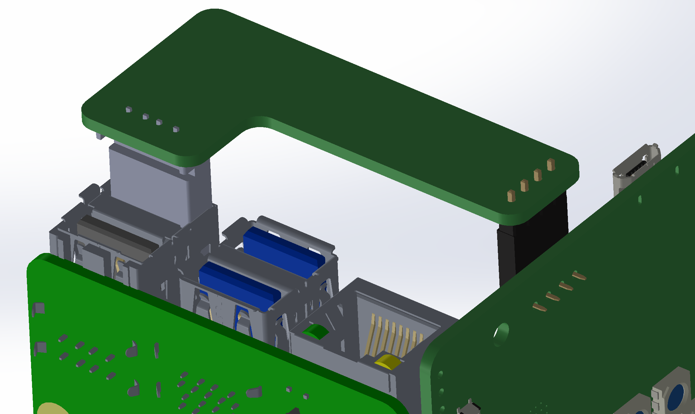

# SJ202 - USB Jumper Board

*⛵️ Note that this repository is a work-in-progress. It will be updated and improved on over time.*

This board connects the Raspberry Pi 4 to the SJ201-Raspberry Pi 4 Daughterboard

