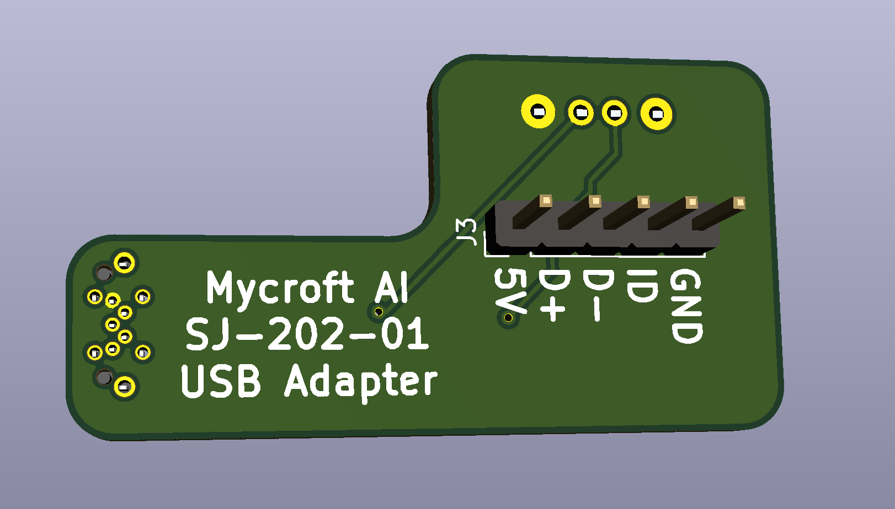

# SJ202 - USB Jumper Board

*⛵️ Note that this repository is a work-in-progress. It will be updated and improved on over time.*

This board connects the Raspberry Pi 4 to the SJ201-Raspberry Pi 4 Daughterboard. This jumper board connects to the USB 2.0 port on the Raspberry Pi 4, leaving both of the USB 3.0 ports open.

# BOM
This jumper uses a USB-A Header and a 4 pin header

* USB - Type A Male USB 2 4 SMD USB (U-G-04WS-W-03 https://lcsc.com/product-detail/USB-Connectors_Korean-Hroparts-Elec-U-G-04WS-W-03_C283548.html)
* (Pin Header https://lcsc.com/product-detail/Pin-Header-Female-Header_PINREX-210-91-04GB01_C390680.html)