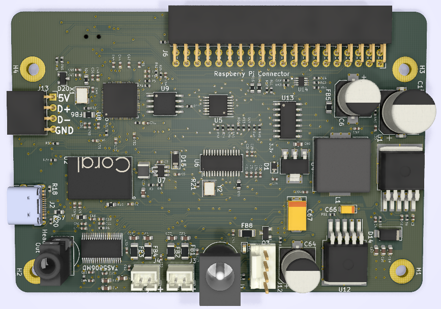

# Mycroft Mark II - DevKit Prototype

*⛵️ Note that this repository is a work-in-progress. It will be updated and improved on over time.*

The second iteration of the Mark II prototype. 

## SJ201 Daughterboard
This prototype includes a custom daughterboard (SJ201) that integrates the components from the OTS prototype into a single PCB (SJ201).

The SJ201 interfaces directly to the Raspberry Pi 4 via the 40-pin GPIO adding a high-quality speaker and microphone array, as well as LEDs and hardware inputs for non-voice interaction and feedback.

The SJ201 can also be used as a USB microphone array with barge-in support. In this configuration the amplifiers do not work as the USB port cannot supply the required power.

The part number SJ201 is derived from Mike’s “Simon Jester” alias in “The Moon is a Harsh Mistress”.

### Major Components
* 23W I2S Digital Amplifier (Texas Instruments TAS5806MD)
* USB 4-port Hub Controller (FE1.1s https://cdn-shop.adafruit.com/product-files/2991/FE1.1s+Data+Sheet+(Rev.+1.0).pdf)
* 2 Digital MEMS Microphones (Knowles SPK0641HT4H-1 https://www.digikey.com/en/products/detail/knowles/SPK0641HT4H-1/8573345)
* 12 RGB LEDs (WorldSemi WS2812B-MINI)
* 3 momentary buttons (volume up, volume down, action)
* 1 toggle switch (mic mute)
* ATtiny1614 - control LEDs, other I/O
* Google Coral TPU

### SJ-202 - USB Jumper

### Technical Documentation
For technical details of these board see the 
* [SJ201-Datasheet](./KiCAD/SJ201-Raspberry%20Pi%204%20Daughterboard/README.md).
* [SJ202-Datasheet](./KiCAD/SJ202-USB%20jumper%20board/README.md).

## New Form Factor
The SJ201 connects to the Raspberry Pi GPIO header at a 90 degree angle. This allows the microphone array and hardware inputs to be well positioned in the enclosure, whilst maintaining the simplicity of a direct connection to the main board. 

This interface makes a landscape form factor the most viable for this prototype. The blocking of the major components can be found within the [Mechanical CAD > MkII Blocking r2.zip](./Mechanical%20CAD/MkII%20Blocking%20r2.zip). 

## Our open hardware principles
* **Copy our designs** – build your own Mycroft Mark 2 - Raspberry Pi Edition or its individual parts
* **Modify our designs** – remixing is encouraged
* **Sell products based on our designs** – commercial use is permitted
* **Always keep the open license** – contribute your output back to the community
* **Credit the original author(s)** – like they do in science

## Feedback or ideas

We are always keen to hear from the community about ways to improve these designs. Whether you're a hacker, maker, engineer, or something else - join us in the:
- [Community Forums](https://community.mycroft.ai)
- [Community Chat](https://chat.mycroft.ai)
- or email us at [dev@mycroft.ai](mailto:dev@mycroft.ai)
