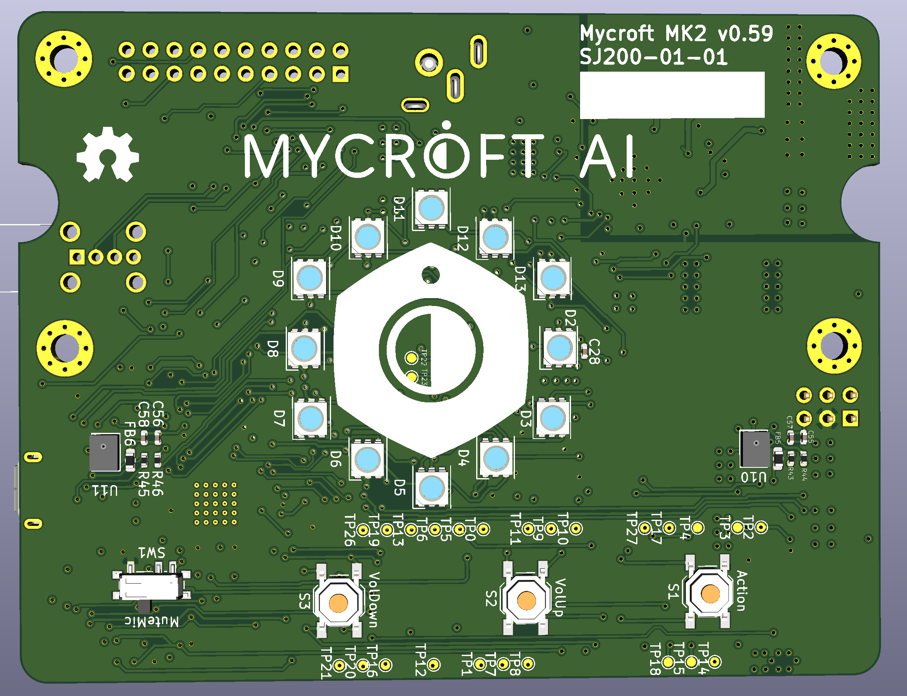
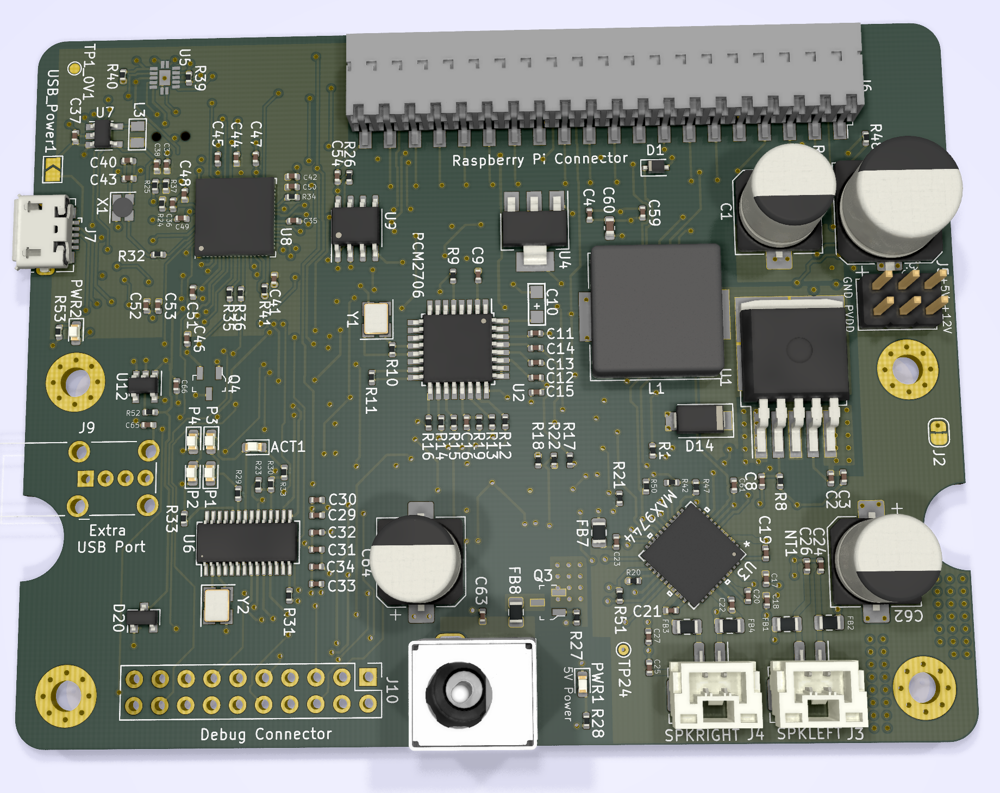

# Mycroft Mark II - Prototype Printed Circuit Board

*⛵️ Note that this repository is a work-in-progress. It will be updated and improved on over time.*

This is the first prototype design for the Mark II daughterboard PCB (SJ201).

This board interfaces directly to the Raspberry Pi 4 via the 40-pin GPIO adding a high-quality speaker and microphone array, as well as LEDs and hardware inputs for non-voice interaction and feedback.

The SJ201 can also be used as a USB microphone array with barge-in support. In this configuration the amplifiers do not work as the USB port cannot supply the required power.

The part number SJ201 is derived from Mike’s “Simon Jester” alias in “The Moon is a Harsh Mistress”.

## Major Components
* USB Soundcard (PCM2706)
* Audio Front End (XMOS XVF-3510) - for Microphone input processing
* 20W Amplifier (Maxim Integrated MAX9744)
* 2 Digital MEMS Microphones (ST Micro MP34DT05)
* 12 RGB LEDs (WorldSemi WS2813-MINI)
* 3 momentary buttons (volume up, volume down, action)
* 1 toggle switch (mic mute)

## New Form Factor
There is a new form factor for the Mark II. The new form matches the simplicity to our approach to SJ201 daughterboard. The blocking of the major components is found within the MkII Blocking r2.zip. 

## Our open hardware principles
* **Copy our designs** – build your own Mycroft Mark 2 - Raspberry Pi Edition or its individual parts
* **Modify our designs** – remixing is encouraged
* **Sell products based on our designs** – commercial use is permitted
* **Always keep the open license** – contribute your output back to the community
* **Credit the original author(s)** – like they do in science

## Technical Documentation
For technical details of this board see the [SJ201-Datasheet](SJ201-Datasheet.md).
