# AS290 Body Assembly:
## Parts: 
-   AS291 Top Assembly X 1
-   AS292 Loudspeaker Assembly X 1
-   AS293 Display & Grill Assembly X 1
-   SJ250-01 Body X 1
-   SJ250-05A Boss Ext. R Assembly X 1
-   SJ250-06A Boss Ext. L Assembly X 1
-   SJ232.2 Black Speaker Grommets X 4
-   SJ222 Fan X 1
-   SJ245-10 m2.5x10mm Thread Screw X 4
-   SJ245-8 m2.5x8mm Thread Screw X 7
-   SJ241 Feet X 4
-   SJ243-8 m2.5x8mm Wafer Machine Screw X 2
-   SJ248 Nylon Plastic Washer X 3
-   SJ247 Ferrite Bead X 1
-   SJ263 Adhesive Velcro Loop
-   SJ264 Adhesive Velcro Hook
## Tools: 
-   PH1 Screwdriver
-   Pointy Tweezers
-   Body Assembly Jig
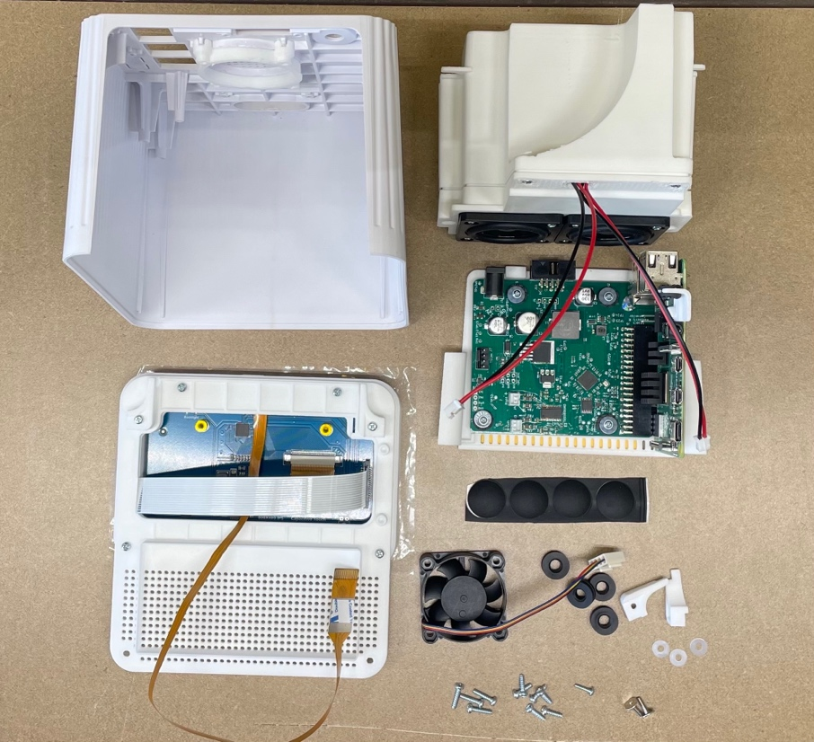{width="4.115867235345582in"
height="3.755729440069991in"}
Step:
1.  Take the *SJ250-01 Body* and remove any burrs around the upper
    corners pictured below. See before and after pictures:
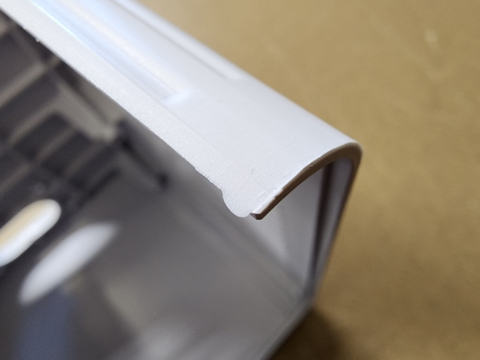{width="3.1527777777777777in"
height="2.3645833333333335in"}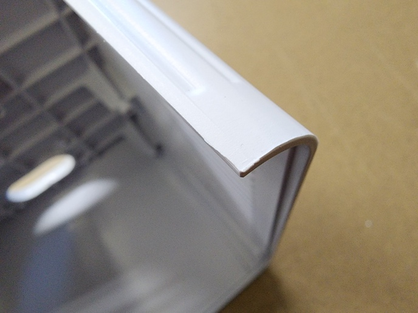{width="3.125in"
height="2.34375in"}
2.  Using (4) *SJ245-10 m2.5x10mm* Thread Screws install *SJ222 Fan on
    SJ250-01 Body* with the wire positioned towards the top of the
    assembly as shown
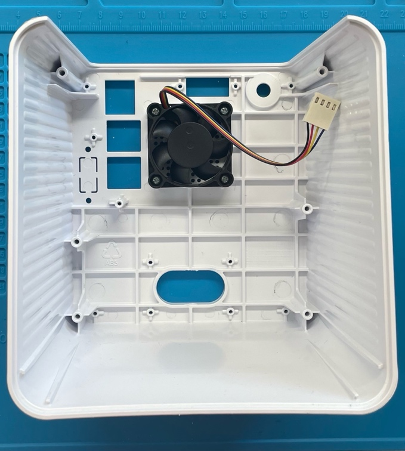{width="3.0867410323709534in"
height="3.437669510061242in"}
3.  Take *AS291 Top Assembly* and slide it into *SJ250-01 Body,* use (2)
    *SJ245-8 m2.5x8mm Thread Screws* to attach the *Top Assembly* to the
    B*ody* at top corners.
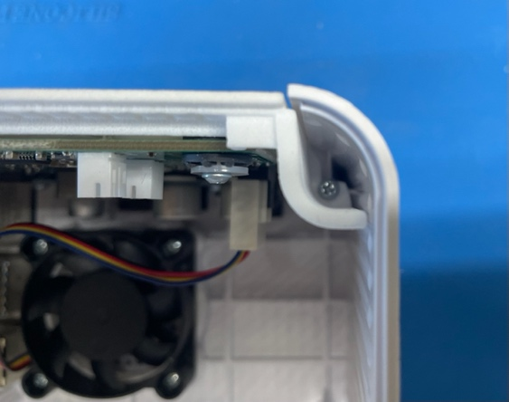{width="2.560184820647419in"
height="2.0161461067366577in"}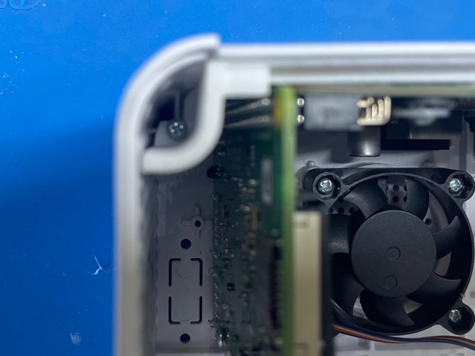{width="2.6805555555555554in"
height="2.0104166666666665in"}
4.  Plug in fan
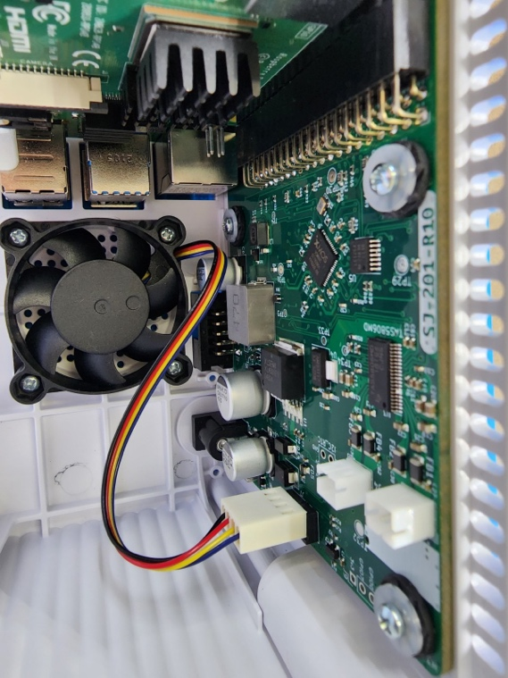{width="2.5859372265966756in"
height="3.4479166666666665in"}
5.  Use (1) *SJ244-8 M2 x 8mm Thread Screw* and (1) *SJ248 Nylon Plastic
    Washer* to *secure SJ250-07 RPI Mount* to the *Body.*
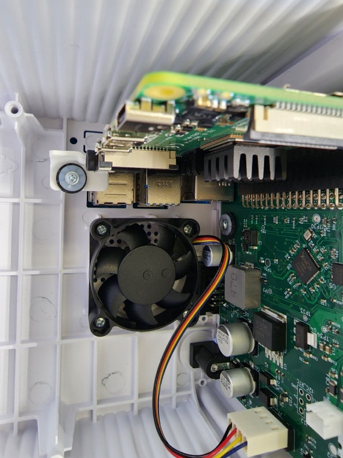{width="2.5859372265966756in"
height="3.4479166666666665in"}
6.  Locate *AS293 Display & Grill Assembly. Use* Body Assembly Jig to
    hold the Body and the Display & Grill Assembly. Locate the cable for
    *J227 Camera* and plug into *SJ220 Raspberry Pi Assembly* making
    sure to orient the cable in the correct direction.
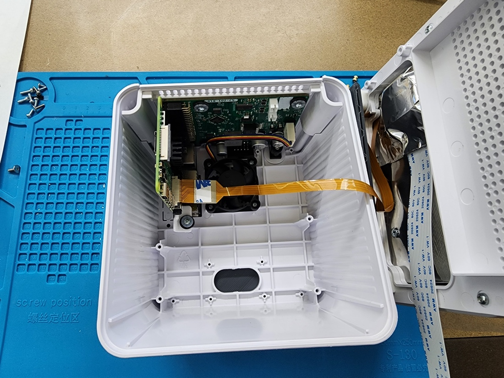{width="5.0in" height="3.75in"}
7.  Locate *AS292 Loudspeaker Assembly,* place (4) *SJ232.2 Black
    Speaker Grommets* on the *Loudspeaker Assembly* as shown and plug
    in. The short cable should be plugged into the bottom plug and the
    long one into the top plug. (Long = Left channel)
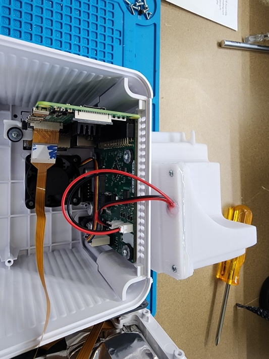{width="2.423611111111111in"
height="3.2314818460192476in"}
8.  Move the *AS293 Display & Grill Assembly* to the left side and
    rotate the *AS292 Loudspeaker Assembly* into the body making sure
    the fan cable does not get caught on the upper right corner of the
    audio chambe*r.*
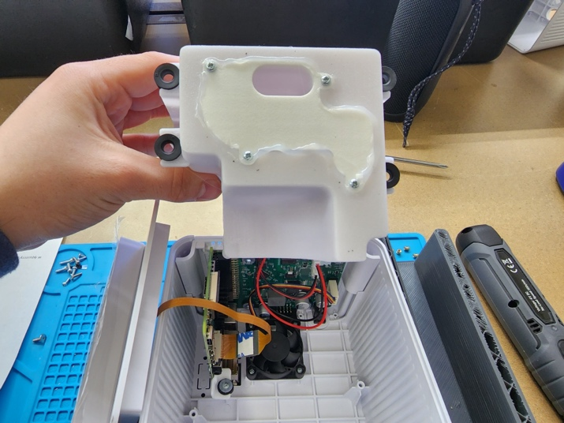{width="3.25in"
height="2.4375in"}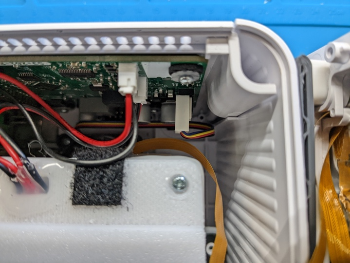{width="3.2708333333333335in"
height="2.4531255468066493in"}
9.  Slide *AS292 Loudspeaker Assembly* into SJ250-01 Body. Place (2)
    *SJ248 Nylon Plastic Washers* on each of the upper holes on the
    *AS292 Loudspeaker Assembly* using tweezers, than screw down
    with (2) *SJ245-8 m2.5x8mm Thread Screws.*
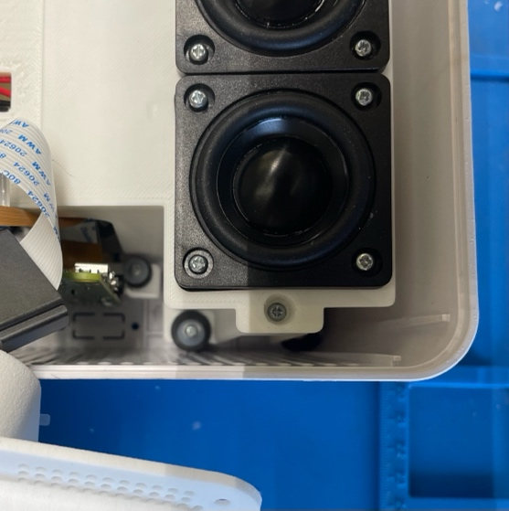{width="2.530599300087489in"
height="2.5411876640419946in"}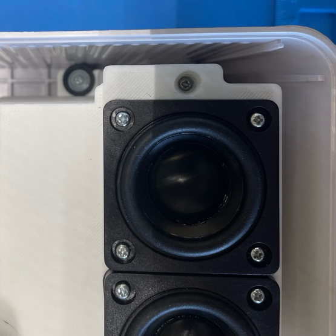{width="2.5208333333333335in"
height="2.5208333333333335in"}
10. Locate *Boss Ext. R Assembly* and *Boss Ext. L Assembly* (If
    J*210-IN m2.5 Threaded Inserts* have not been installed on *Boss
    Ext. R* and *Boss Ext. L* do so at this time *--* See Boss Ext.
    Assembly) Using (2) *SJ245-8 m2.5x8mm Thread Screws* install in
    lower corners of *Body.*
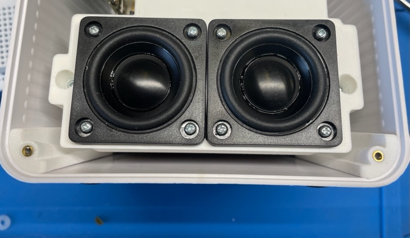{width="3.6354166666666665in"
height="2.113086176727909in"}
11. Place the *AS293 Display & Grill Assembly* back into the jig on the
    right and slide the SJ247 Ferrite Bead onto the display cable and
    plug the cable into the Raspberry Pi with the blue side facing up.
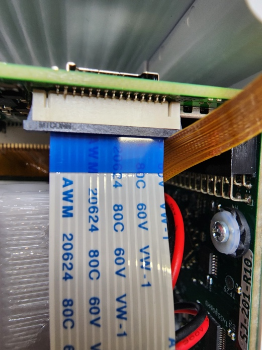{width="2.3671872265966756in"
height="3.15625in"}
12. Take the loop side of the Velcro and adhere to the loudspeaker
    assembly, stick the hook side of the Velcro onto the bottom of the
    ferrite bead as shown and stick together.
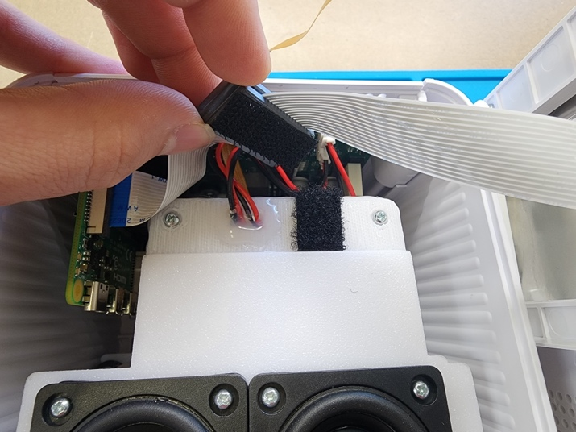{width="3.25in" height="2.4375in"}
13. Place *AS293 Display Assembly & Grill Assembly* on front of the
    *SJ250-01 Body* and screw closed using (2) SJ243-8 m2.5x8mm Wafer
    Machine Screws.
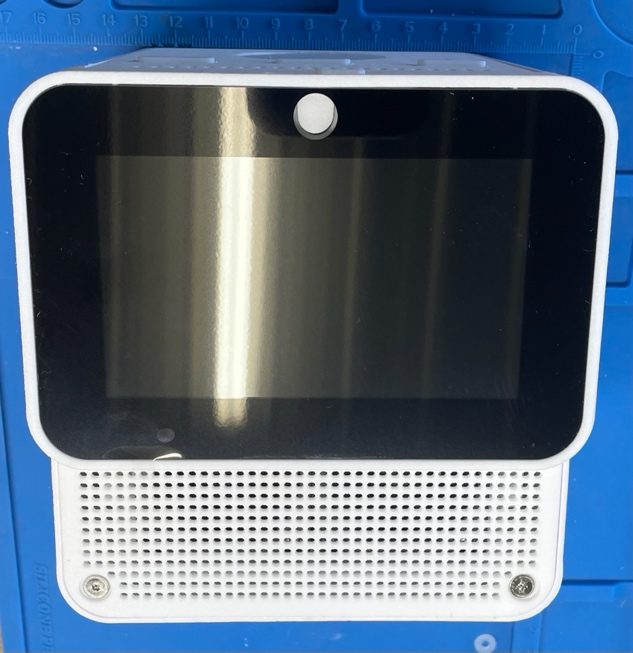{width="2.875in"
height="2.9677416885389327in"}
14. Apply (4) *SJ241 Feet* to the bottom of the *Body* as shown.
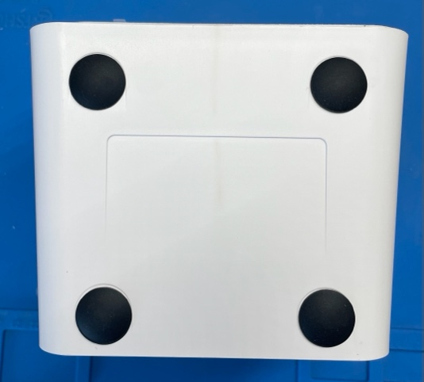{width="2.424942038495188in"
height="2.1875in"}
