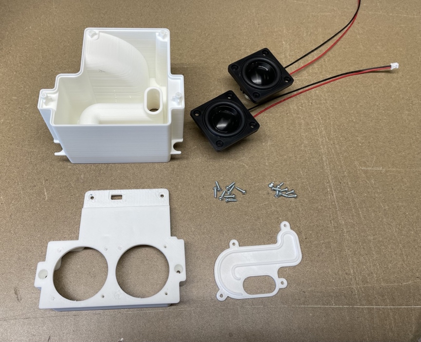
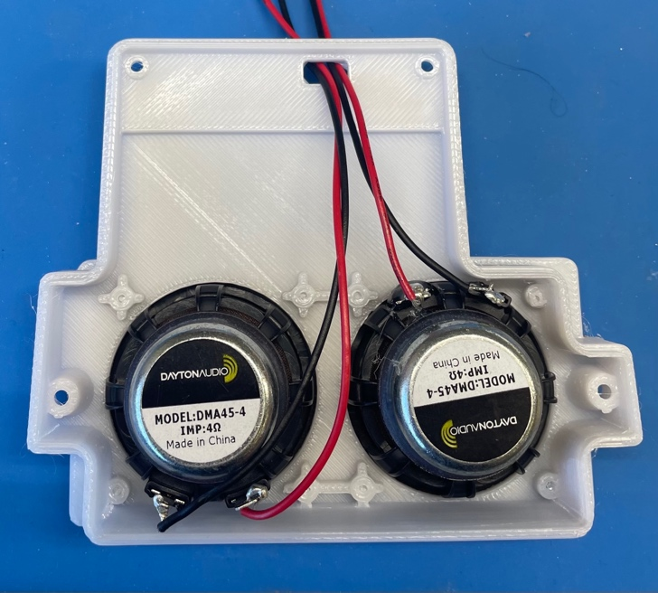
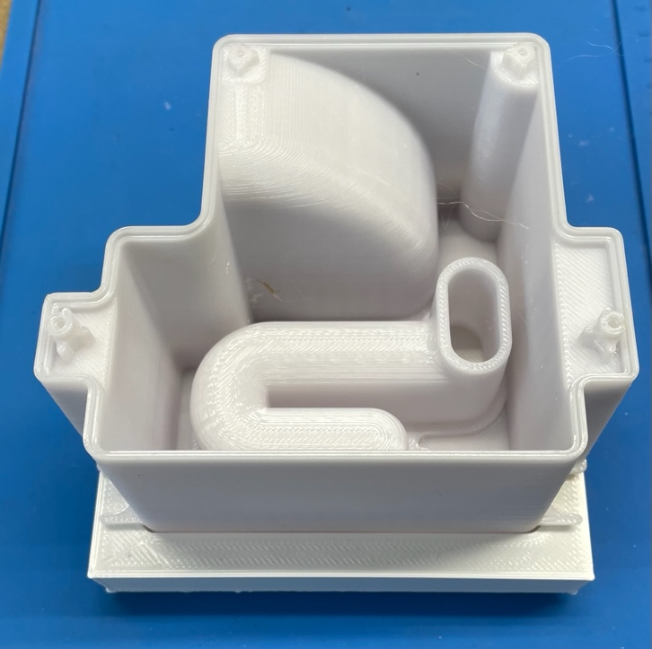
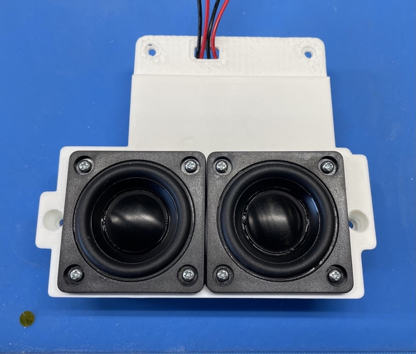
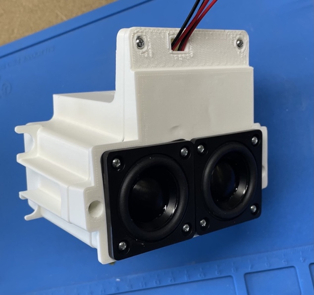
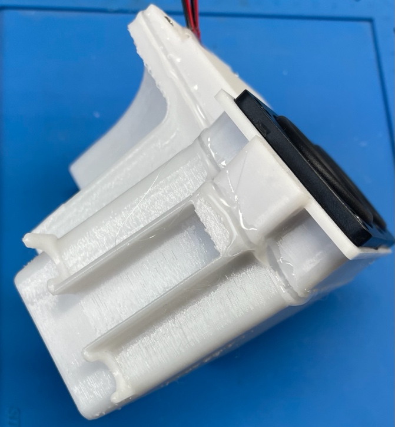
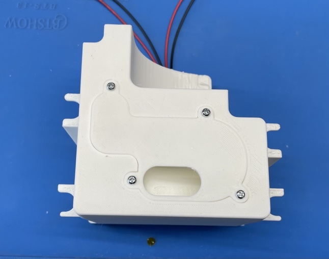
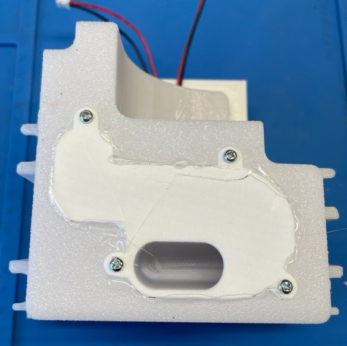

# AS292 Loudspeaker Assembly:

## Parts: 
-   SJ250-13 Audio Chamber F X 1
-   SJ250-14 Audio Chamber R X 1
-   SJ250-15 Audio Chamber Port X 1
-   SJ205 Speaker Driver Assembly X 2
-   SJ245-6 m2.5x6mm Thread Screw X 8
-   SJ245-8 m2.5x8mm Thread Screw X 8
-   SJ261 Hot Glue

## Tools:
-   PH1 Screwdriver
-   Needle Nose Plyers
-   Hot Glue Gun
-   Loudspeaker Jig 1
-   Loudspeaker Jig 2

Step:

1.  Install (2) *SJ205 Speaker Driver Assemblies* into *SJ250-13 Audio
    Chamber F* situating the wires as shown below. Feed wires through
    top hole.

2.  Place *SJ250-14 Audio Chamber R* into *Loudspeaker Jig 1. P*lace
    assembly from Step 2 onto *SJ250-14 Audio Chamber R.*

3.  Install (2) *SJ205 Speaker Driver Assemblies* into *SJ250-13 Audio
    Chamber F* using (8) *SJ245-8 m2.5x8mm Thread Screws*

4.  Attach assembly from step 1 to *SJ250-14 Audio Chamber R* using (4)
    *SJ245-6 m2.5x6mm Thread Screws.* Use *SJ261 Hot Glue* to seal.

5.  Apply *SJ261 Hot Glue* around *AS292 Loudspeaker Assembly where
    SJ250-13 Audio Chamber F* and *SJ250-14 Audio Chamber R* meet.

6.  Using the assembly form step 2, attach *SJ250-15 Audio Chamber Port*
    using (4) m2.5x6mm Thread Screws

7.  Apply *SJ261 Hot Glue* around *SJ250-15 Audio Chamber Port* to seal.

