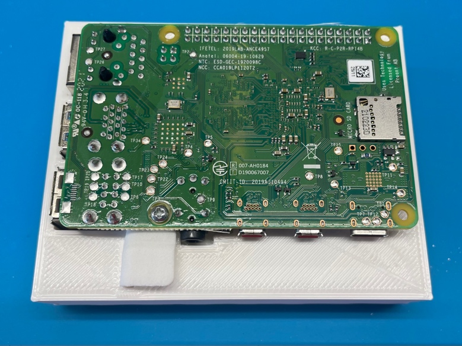

# AS291 Top Assembly:

## Parts: 

-   SJ250-08 Top X 1

-   SJ250-09 Center Button X 1

-   SJ250-11 Mute Switch X 1

-   SJ250-10 Volume Button X 1

-   SJ250-07 RPI Mount X 1

-   SJ201 Mycroft Audio Pi Hat X 1

-   SJ220-01 Raspberry Pi 4 2GB X 1

-   SJ220-02 Raspberry Pi 4 Heatsinks X 1

-   SJ250-12 Microphone Gasket X 2

-   SJ242.2 PCB Grommets X 5

-   SJ245-6 m2.5x6mm Thread Screw X 5

-   SJ248 Nylon Plastic Washer M3 X 4

Tools:

-   PH1 Screwdriver

-   Blunt Tweezers

-   Sharp Tweezers

-   RPI Jig

Step:

1.  Take *SJ250-08 Top* and place (2) *SJ250-12 Microphone Gaskets* on
    the bottom as shown.

2.  Using the assembly from Step 1, place *SJ250-09 Center Button*,
    *SJ250-11 Mute Switch* and SJ250-*10 Volume Button* as shown. (Make
    sure *SJ250-11 Mute Switch* notch is facing middle of assembly)

3.  Place *SJ250-07 RPI Mount* and *SJ220-01 Raspberry Pi 4 2GB* into
    *RPI Jig* as shown. Attach *RPI Mount* to *Raspberry Pi* using (1)
    *SJ245-6 m2.5x6mm Thread Screw.*

4.  Place *SJ220-02 Raspberry Pi 4 Heatsinks on SJ220-01 Raspberry Pi 4
    2GB* as shown. Install *SJ242.2 PCB Grommet on SJ250-07 RPI Mount.*

5.  Place (*4) SJ242.2 PCB Grommets into holes on SJ201 Mycroft Audio Pi
    Hat as shown.*

6.  Attach *SJ220-01 Raspberry Pi 4 2GB* on *SJ201 Mycroft Audio Pi Hat*
    using existing pins

7.  *Using (4) SJ245-6 m2.5x6mm Thread Screws* and (4) *SJ248 Nylon
    Plastic Washers*, attach the *Assembly* from Step 6 to the *Top
    Cover Assembly* from Step 2 as shown. *(*Attach screws in an X
    pattern, and test slider switch after installing 2 of the 4 screws
    to verify alignment.)

8.  Test all buttons and slider a final time.
